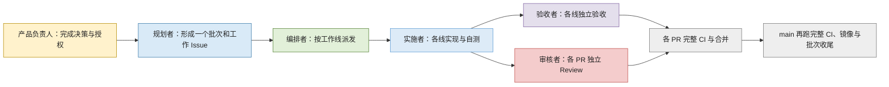
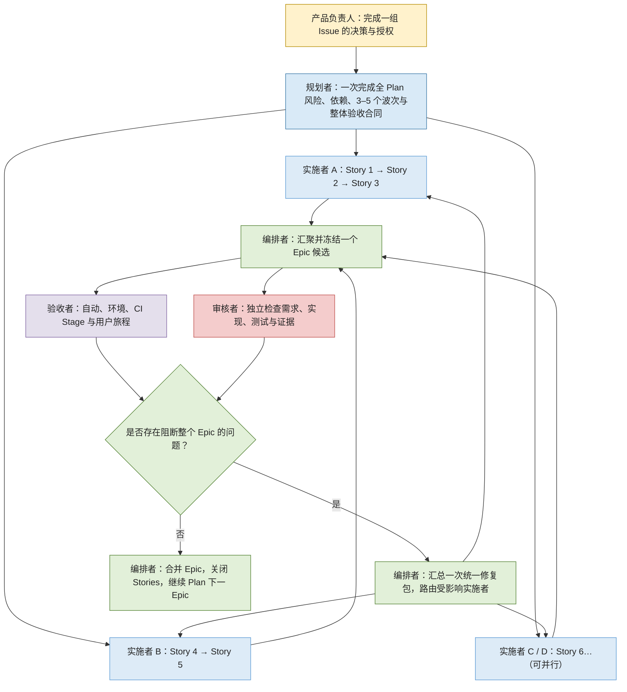

# 长期执行计划与开工模板

> 状态：现行 v10；本文件所在提交进入 `main` 后生效。来源：[Issue #83](https://github.com/Moshuiwang/lingxi/issues/83)。
>
> 适用：需要持续完成多个已决策 Issue，或包含多个 Epic、多角色、依赖、并行波次、高风险验收的工作。单一低风险工作仍直接使用原 Issue，不建立 Plan。

本文是 Lingxi 长期执行方法和 `[tracking]` Plan 模板的唯一正文。它只定义工作层级、角色、状态与执行闭环；GitHub 写入、身份、环境和发布交接看[协作约定](../协作约定.md)，证据层级与“什么算通过”看[验证与门禁](../技术设计/验证与门禁.md)，产品断言按需读取[验收矩阵](../技术设计/验收矩阵.md)。

## 一、v9 实际怎样工作

v9 已能编排一个批次，但工作 Issue、验收、Review、PR 与完整 CI 多按实施线各自收口；跨线合并后还会在 `main` 重跑完整门禁和镜像。这张图只还原现实，不把 v9 描述成 v10。



## 二、v10 的四层工作

| 层级 | 回答的问题 | 默认载体与交付 |
| --- | --- | --- |
| Plan | 这段长期执行要清空哪些已决策工作，顺序、风险和授权终点是什么 | 一个长期打开的 `[tracking]` Issue，持续包含多个 Epic |
| Epic | 哪组 Story 共同形成一个可独立验收、冻结和发布的完整结果 | `[epic]` Issue、`epic/**` 候选分支、一个最终 PR 到 `main` |
| Story | 用户、管理员或系统可观察到的一段完整价值或工程结果 | `[story]` Issue、一个 PR 到 Epic 分支；可并行或串行 |
| Task | 完成 Story 所需的具体动作 | 默认是待办、提交或代理子任务；只有需要独立跟踪时才创建 `[task]` Issue |

人类新建 Issue 时不必判断它属于哪一层。需求、缺陷、研究或决策 Issue 都可以先如实描述；规划者形成 Plan 时再归类、合并或拆分。一个原始 Issue 可以成为 Story、Epic 的输入，也可以继续作为独立研究或决策项。

Plan 不限制长期工作只能有一个 Epic。产品负责人批准一次 Plan 后，编排者可以持续推进其中全部 Epic，直到授权范围清空或遇到新的产品边界；不需要每完成一个 Epic 再请求一次“开工”。

## 三、v10 整体工作总览



波次约束的是依赖与共享文件顺序，不要求所有工作串行。后续 Epic 的低风险 Story 可以提前实施，但同一时刻只允许一个 Epic 进入最终冻结、`Epic Full` 与合并窗口。

## 四、角色职责与路由

v10 不增加常驻角色。编排者根据阶段和风险，把现有 Agent 路由到以下职责；同一个 Agent 是否兼任，按风险决定。

| 角色 | 主要职责 | 不拥有的权力 |
| --- | --- | --- |
| 产品负责人 | 决定用户结果、范围、优先级、权限与授权终点；批准 Plan | 不替代理执行技术验收 |
| 规划者 | 归类原始 Issue，形成 Plan / Epic / Story / Task、风险依赖、3–5 个波次和整体验收合同 | 不实施，不替产品负责人作决定 |
| 编排者 | Plan 和批次状态 Owner；派发、控制并行、冻结候选、调用门禁、汇总阻断项、路由统一修复包、推进关闭 | 不放宽产品范围或验收标准，不把自报当通过 |
| 实施者 A/B/C/D | 在分配的 Story / Task 内实现、白盒测试、基础自审；收到修复包后只修受影响范围 | 默认不改其他 Story，不自行合并或发布 |
| 验收者 | 规划时共同确定可执行的验收资产；实施期间编写或维护脚本、夹具、CI Stage、环境探针和用户旅程；冻结后独立执行并解释证据 | 不在最后才补验收，不修改产品代码或放宽标准 |
| 审核者 | 检查需求、实现、测试与证据是否一致 | 只报告发现，不直接修复 |

“外部审核者”是审核者的高风险工作模式：由未参与实现、上下文隔离的 Agent 做红队式查证。它不是新增长期角色，也不要求每个 Story 都调用。

## 五、执行规则

### 5.1 规划与开工

1. 产品负责人先处理会改变用户承诺、权限、数据或外部边界的未知项。
2. 规划者读取已批准范围内的 Issue，形成多个 Epic；每个 Epic 拆成可观察的 Story，再按需要拆 Task。
3. 一次完成全 Plan 的风险、依赖、共享文件 Owner、3–5 个波次和整体验收合同。验收者在此阶段确认关键验收资产是否可执行。
4. 产品负责人批准 Plan 和授权终点后，一句话即可授权编排者持续执行，不逐 Epic 重复开工。

### 5.2 Story 实施

- Story 默认通过 PR 合入 `epic/**`，由 Ruleset 强制 `Story Fast`。
- 纯文档只跑文档门禁；普通代码跑无真库、无镜像的快检；迁移、部署、依赖、CI 自身与未知路径自动升级完整门禁。
- Story 的基础自审、白盒测试和适用快检必须通过，但不为每个 Story 重复完整独立验收、完整 Review 和四镜像构建。
- 身份、权限、安全或跨模块高风险 Story 可以提前切换完整门禁或外部审核模式；这是风险路由，不是默认流程。

### 5.3 Epic 冻结、验收与修复

1. 所有入选 Story 汇聚后，编排者冻结一个明确提交；冻结期间实施者停止写入。
2. 验收者在同一冻结候选上执行自动门禁、环境检查、CI Stage 和适用用户旅程；审核者并行独立审查。
3. 各路发现先全部返回，再由编排者去重、分级，形成一次统一修复包；不得一个发现回来就立刻解冻，随后又为下一发现重复返工。
4. 修复只路由受影响实施者。完成后先跑相关快速复验，再冻结新候选并只运行一次完整验收与审核复核。
5. 无阻断项后，Epic PR 合入 `main`；Ruleset 强制 `Epic Full`，`Main Publish` 只复用该候选并单次构建发布镜像，不在主干重跑完整门禁。

P1 是会破坏用户结果、权限、安全、数据、关键失败语义或合并门禁的问题，进入下一阶段前必须解决或请产品负责人决定。P2 默认随 PR 登记或另建 Issue；只有会伤害本 Plan 后续 Epic 时才纳入当前修复包。

### 5.4 完成与停止

- Epic 合并后关闭其 Stories，回写需要长期保留的文档和未完成项；Plan 自动继续下一个已批准 Epic。
- Plan 在已批准范围清空、达到授权终点后关闭。
- 只有目标不明确、权限不足、出现新的产品/数据/安全边界或不可逆外部动作无法判断时，停止受影响部分请求人类；独立 Epic 可以继续。
- 时间、Token 或轮次超出预期时，编排者先缩小切片、调整并行、复用验收资产或更换路由，不自动终止整个 Plan。

## 六、Plan 状态

| 状态 | 含义 |
| --- | --- |
| `Planning` | 人类决策或 Plan 拆分尚未完成 |
| `Ready` | Plan、验收合同与授权终点已批准，可一句话开工 |
| `Executing` | 一个或多个 Epic 的 Story 正在实施 |
| `Epic Frozen` | 唯一一个 Epic 进入最终验收与审核窗口 |
| `Repairing` | 阻断项已汇总为统一修复包 |
| `Waiting for PM` | 只等待产品、权限、安全或不可逆边界决定 |
| `Complete` | 已批准范围清空并完成收尾 |

## 七、Plan Issue 模板

复制以下字段创建 `[tracking] YYYY-MM-DD 长期计划：一句话目标`。删除占位符和不适用项；创建后读回核对。规划者若只获授权形成计划，到此停止，不开始实施。

```markdown
## 给人类

- 最终得到什么：
- 仍需人类介入：无 / 具体事项
- 一句话开工后的授权终点：

## Plan 合同

- 状态：Planning / Ready / Executing / Epic Frozen / Repairing / Waiting for PM / Complete
- 已批准目标与不做：
- 输入 Issue：
- 执行合同版本与批准时间：
- 完成标准：
- 停止条件：

## Epic 与波次

| 波次 | Epic | Stories | 依赖 | 可并行范围 | 共享文件 Owner | 完成证据 |
| --- | --- | --- | --- | --- | --- | --- |
| 1 | # | #、# | 无 | A / B / C | 路径 → Owner | Story Fast / Epic Full / L4 |

## 角色路由

| 角色 | Agent / 模型 | 范围 | 权限与边界 |
| --- | --- | --- | --- |
| 编排者 |  | 全 Plan | 状态、冻结、统一修复、合并流程 |
| 实施者 A/B/C/D |  | Story / Task | 仅分配范围 |
| 验收者 |  | 验收资产与证据 | 不改产品代码 |
| 审核者 / 外部审核模式 |  | 风险与一致性 | 不直接修复 |

## 验收合同

- Story Fast 适用范围：
- Epic Full 与环境门禁：
- 受控真实用户旅程：
- 验收资产的创建 / 维护 Owner 与时点：
- 冻结、统一修复和重新冻结规则：

## 动态记录

- 当前 Epic 与冻结提交：
- 已完成 / 进行中 / 等待：
- 统一修复包与复验：
- 人类待办：
```

## 八、记录边界

- Plan 只维护合同版本、Epic 状态、波次、跨线决策和证据链接；具体实现与一次性日志留在 Story Issue / PR。
- 仓库 `docs/` 保存长期有效的方法与产品事实；Issue 保存可关闭的工作历史，不复制长期正文。
- 每个 Epic 收尾记录：用户得到什么、Story / PR、证据层级、未验证项、后续项与资源耗时。Plan 完成后再做一次整体复盘。

## 版本记录

- **v10（2026-08-07）**：引入 Plan > Epic > Story > Task；支持一次批准后连续执行多个 Epic；Story PR → Epic 分支、Epic PR → `main`；Story Fast / Epic Full / Main Publish 分层；验收资产前置维护；一个 Epic 一次冻结、统一修复、一次重验；外部审核作为审核者高风险模式；方法、协作机制与产品验收资产解耦。
- **v9（2026-08-07）**：按批次 #64 复盘固化冻结纪律、质量流并行、共享资源、变异与自动检查验红等规则；历史入口见 [Issue #59](https://github.com/Moshuiwang/lingxi/issues/59)。
