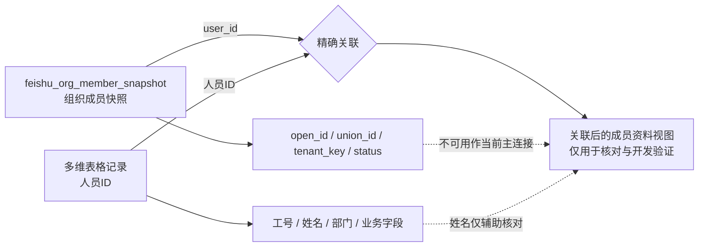

# 飞书组织快照与多维表格关联

> 状态：测试架构已受控验证，正式业务入口尚未接入。
> 最后验证：2026-08-05，`biai-stage` / `Bot-Test` / 测试 PostgreSQL。
> 本文回答“两个外部数据面如何读取、如何关联、哪些字段可以信任”；产品权限权威仍以[产品合同与外部边界](../产品合同与外部边界.md)为准。

## 1. 这条链路解决什么问题

Lingxi 需要同时使用两类飞书数据：

1. **关联组织成员快照**：以专用 User 身份遍历关联企业、部门和成员，取得三类飞书身份标识及成员资料；
2. **飞书多维表格**：读取下游已经存在的人员信息表，取得业务表中的人员 ID、工号、姓名、部门和其他字段。

两类数据不是同一张表，也不是同一个数据源的天然外键。当前受控验证已经证明，可以用多维表格的「人员ID」与组织快照的 `user_id` 建立精确关联；姓名和工号不能替代这条关系。

这条关联只用于身份资料核对、字段补齐和后续受控开发验证。它不把多维表格提升为权限权威，也不允许通过多维表格反向创建或扩大 Lingxi 权限；权限边界见[自动准入与数据库权限发布边界决策](../决策记录/2026-07-26-自动准入与数据库权限发布边界.md)及[产品合同](../产品合同与外部边界.md)。

## 2. 两个数据面

### 2.1 数据面 A：关联组织成员快照

入口脚本是 [`scripts/sync_feishu_org_snapshot.py`](../../scripts/sync_feishu_org_snapshot.py)。它在测试环境中执行两条身份路径，并在完整性校验通过后，把一轮结果写入测试库：

> **⚠️ 这个脚本当前跑不起来（2026-08-19 核实）。** 它的 User 身份令牌取自 `feishu_user_refresh_token` 表，而**那张表不在当前 alembic 架构里**（属 `migrations/testing/` 的历史测试资产，已被迁移 006 显式声明替代）。因此下方 4.1 的命令**照抄会失败**，本节保留是为了记录当初那一轮受控验证是**怎么做的、拿到了什么**，不是可复用的操作步骤。
>
> **产品侧也没有替代品**：`adapters/postgres_identity.py` 的 `PostgresOrgSnapshotStore` 具备写入能力，但全仓库**零调用方**——没有任何产品代码或脚本会填这四张快照表，`biai-stage` 上它们至今全空。
>
> **正规做法**：按产品负责人 2026-08-18 的裁定（开通链整体搬进 `scheduler`），组织快照同步应作为 `lingxi-scheduler` 的一条定时职责，走 `commit_batch`，**复用凭据轮换职责进程内那个唯一的派生令牌持有者**——一次性 `refresh_token` 全系统只允许一个消费者，任何在该进程之外自行换取令牌的做法都会重演 2026-08-08 烧掉一次性授权码的事故。该项按分账属 **Epic B / #158 未达 Ready 条件**，跟踪见 [#203](https://github.com/Moshuiwang/lingxi/issues/203)。

| 内容 | 读取方式 | 落库位置 |
|---|---|---|
| 关联租户及应用可见范围 | 应用 `tenant_access_token`；`directory/v1/collaboration_tenants`、`directory/v1/share_entities` | `feishu_org_tenant_snapshot` 的 `app_record` |
| User 可见租户、部门和成员 | 专用 User `user_access_token`；`trust_party/v1/collaboration_tenants`、`visible_organization` | `feishu_org_tenant_snapshot.user_record`、部门/成员表 |
| 成员详情 | User 身份调用 `collaboration_users/{id}` | `feishu_org_member_snapshot.detail_record` |
| 原始业务响应 | JSON 原样保留，先完成内存完整性校验 | 各快照表的 `app_records` / `user_records` / `detail_record` |

成员快照的标准化字段包括：

```text
tenant_key
member_key
open_user_id
open_id
user_id
union_id
union_user_id
name / i18n_name
avatar
status
parent_department_ids
```

当前测试库中对应的表为：

- `feishu_org_sync_run`：同步批次、状态、数量、过期时间；
- `feishu_org_tenant_snapshot`：租户级资料；
- `feishu_org_department_snapshot`：部门级资料；
- `feishu_org_member_snapshot`：成员级资料及原始响应。

2026-08-05 最新完整批次回读事实：

- 8 个关联租户；
- 279 个部门；
- 712 条成员快照、712 条成员详情；
- 712 个 `open_id`、710 个不同 `user_id`、712 个不同 `union_id`；
- 快照默认 90 天到期，当前批次的 `expires_at` 由数据库记录决定；
- 不写入 `app_user`，不保存 App Secret、access token、refresh token、授权码或数据库凭据。

### 2.2 数据面 B：飞书多维表格

读取入口是 [`scripts/read_feishu_bitable_association.py`](../../scripts/read_feishu_bitable_association.py)。它使用已加密保存的 User 续期凭据换取短期 `user_access_token`，然后只读调用多维表格 API：

```text
GET /open-apis/bitable/v1/apps/{app_token}/tables
GET /open-apis/bitable/v1/apps/{app_token}/tables/{table_id}/fields
GET /open-apis/bitable/v1/apps/{app_token}/tables/{table_id}/records
```

三类接口都按 `page_token` 分页读取；脚本只在内存中保存本轮记录用于统计，不把多维表格原始行写入测试库。

本次读取的 Base 由产品负责人提供，表名为：

```text
1.四达时代：飞书全部人员信息表
```

当前真实回读结果：

- 1 张表；
- 38 个字段；
- 1206 条记录；
- 1177 个不同「人员ID」；
- 1192 条记录有 `open_id`；
- 1197 条记录有「工号」。

本表相关字段包括：

```text
人员ID、open_id、工号、人员姓名、人员、员工类型、邮箱、手机号、
账号状态、部门ID列表、部门列表、一级部门、父部门名称、直属上级、
入职时间、职务、租户、record_id、更新时间……
```

脚本需要的 User 授权至少覆盖本次实际使用的只读范围：

```text
base:app:read
base:table:read
base:field:read
base:record:retrieve
bitable:app:readonly
```

APP 管理后台打开权限只是前置条件；已经签发的 User 授权仍需重新同意新增 scope。续期成功后，脚本立即轮换密文 `refresh_token`；短期 `user_access_token` 只存在于进程内。

## 3. 关联关系



### 3.1 主关联键

```text
多维表格.人员ID = feishu_org_member_snapshot.user_id
```

2026-08-05 全量只读关联结果：

| 关联方式 | 命中多维表格行 | 命中不同值 | 结论 |
|---|---:|---:|---|
| `人员ID` → 快照 `user_id` | 718 | 710 | 当前可用的精确身份关联键 |
| `open_id` → 快照 `open_id` | 0 | 0 | 当前数据集不成立，不强行关联 |
| `人员ID` → 快照 `open_id` | 0 | 0 | 证明「人员ID」不是 `open_id` |
| `open_id` → 快照 `user_id` | 0 | 0 | 证明两个字段不能交叉替代 |
| 姓名 → 快照姓名 | 780 | — | 只能辅助核对；其中 29 行对应多条快照成员 |
| 工号 → 快照身份字段 | 0 | — | 组织详情接口不返回工号字段 |

因此，在当前数据和当前快照批次中，710 个不同组织快照 `user_id` 全部可以在多维表格的「人员ID」中找到。718 行而不是 710 行，说明多维表格存在同一人员 ID 的重复记录；不能把多维表格行直接当作唯一员工。

### 3.2 为什么不使用其他字段

- **`open_id`**：多维表格字段非空，但与当前 User 组织快照的 `open_id` 没有一条精确交集。它可能来自不同应用身份命名空间、历史同步或其他业务口径；现有证据不足以判断具体原因，架构不得猜测。
- **姓名**：当前有 780 行可以按姓名找到组织快照候选，但有 29 行存在多个候选；姓名还会受语言、改名和重名影响。
- **工号**：多维表格有工号，但组织成员详情实测不返回 `employee_no`/工号，当前没有第二个数据面可做精确交叉验证。
- **租户**：多维表格有「租户」业务字段，但本次关联统计没有把它当作已验证的 `tenant_key` 映射。若未来需要处理 `user_id` 重复，必须先验证两边租户字段的语义，再采用 `(tenant_key, user_id)` 复合键。

### 3.3 关联后的数据边界

关联结果可以把一条多维表格人员记录补充为：

```text
多维表格业务字段
    + 组织快照的 user_id / open_id / union_id
    + tenant_key
    + status
    + parent_department_ids
    + 原始接口详情（仅在受控测试库内）
```

但这不是权限授予关系：

- 多维表格仍是下游发布/读取通道，不是 Lingxi 权限的唯一权威；
- 组织快照也不是生产 `user` 或 `app_user` 的替代品；
- 任何正式权限必须来自 Lingxi 数据库当前有效记录，并经过产品合同规定的 MCP 同步确认；
- 当前只建立“读取时关联统计”，尚未新增持久化关系表，也没有把关联结果写回多维表格。

## 4. 可复跑方式

### 4.1 先生成组织快照

在受控测试环境加载私有配置后运行：

```bash
# ⚠️ 历史记录，当前跑不起来（见 2.1 的说明）：脚本依赖的 feishu_user_refresh_token
# 表不在当前 alembic 架构里。保留是为了记录当初那一轮验证的执行方式。
set -a
. <受控验收工作目录>/.env
set +a
PYTHONPATH=src python3 scripts/sync_feishu_org_snapshot.py
```

脚本会把一轮完整组织资料写入测试库快照表；失败时不提交半轮可用快照。它不是正式员工开通入口。

### 4.2 读取多维表格并关联快照

Base token 通过受控环境变量传入，不写入代码、文档或日志：

```bash
set -a
. /home/wangzhipeng/projects/lingxi-test/.env
set +a
export FEISHU_BITABLE_APP_TOKEN='<由受控配置注入的 Base token>'
PYTHONPATH=src python3 scripts/read_feishu_bitable_association.py
```

可选地用 `FEISHU_BITABLE_TABLE_ID` 或 `FEISHU_BITABLE_TABLE_NAME` 固定目标表。脚本输出字段名、记录数、关联数、重复数和失败阶段；不输出原始人员行、完整身份标识、令牌或密钥。

脚本的执行顺序是：

1. 从现有加密凭据库读取并解密一条 User 续期凭据；
2. 向飞书刷新 User token，成功后立即把新的 refresh token 加密轮换写回；
3. 读取 Base 的表列表、字段和全部分页记录；
4. 读取测试库最新 `status='complete'` 的组织快照批次；
5. 建立 `人员ID → user_id`、`open_id → open_id`、姓名索引；
6. 输出精确命中、重复、歧义和交叉校验统计；
7. 退出时不写多维表格、不写快照表、不保存多维表格原始数据。

## 5. 验收证据与未决事项

本次证据已经达到“真实试运行并回读”的测试层级：

- User OAuth 重新授权实际返回完整只读 scope；
- 多维表格真实读取到 1206 条记录和 38 个字段；
- 测试库真实读取到 712 条组织成员快照；
- 新脚本真实运行，输出与独立手工探针的关联统计一致；
- 纯函数测试覆盖精确 ID 关联、对象型字段值和姓名歧义，当前 3/3 通过。

仍未知或尚未交付：

- 多维表格中的 `open_id` 与组织快照 `open_id` 为什么完全不相交；
- 多维表格「租户」与组织快照 `tenant_key` 是否同义；
- 多维表格重复人员记录的保留规则；
- 关联结果是否需要持久化为正式关系表、视图或仅在读取时计算；
- 这条测试链路尚未接入正式用户开通、权限发布或问数入口。

上述事项改变前，不得把本测试关联直接当作生产身份绑定或权限判断实现。
